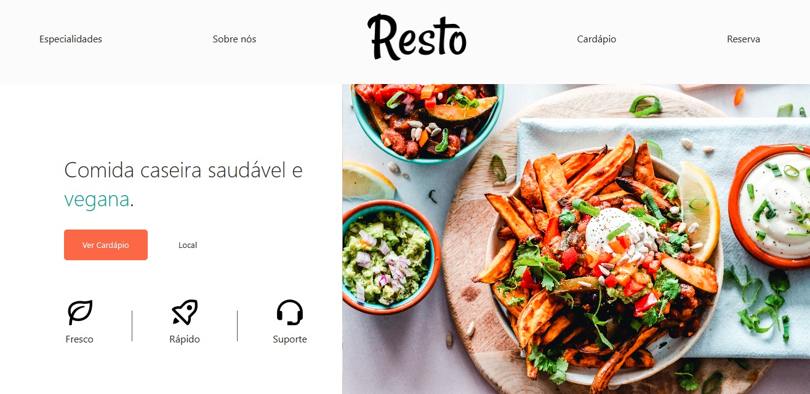

# Resto - Restaurante Vegano
Projeto fictício de um restaurante vegano, para fins de estudo.

## 📝🙌 Regras para contribuição ao projeto🌱💻

Obrigado pelo interesse em contribuir para o projeto do RESTO no GitHub! A colaboração é fundamental para o sucesso deste projeto e estou animado para receber suas contribuições. Para garantir um ambiente de colaboração saudável e eficiente, aqui estão algumas regras que gostaria que todos os contribuidores seguissem:

1. Fork e pull request: Faça um fork do repositório principal do RESTO em sua própria conta do GitHub. Em seguida, crie um branch separado para suas alterações e envie um pull request para que eu possa revisar suas contribuições.

2. Padronização de código: Mantenha uma consistência no estilo de código e siga as convenções estabelecidas no projeto. Isso facilita a leitura e manutenção do código por parte de todos os colaboradores.

3. Seja respeitoso: Respeite as opiniões e ideias de outros contribuidores. Mantenha um ambiente inclusivo, acolhedor e livre de qualquer forma de discriminação ou assédio.

4. Resposta às revisões: Esteja aberto a receber feedback e responder prontamente às revisões realizadas. Isso ajudará a acelerar o processo de colaboração e garantir que suas contribuições sejam integradas ao projeto o mais rápido possível.

5. Licença: Ao enviar suas contribuições, você concorda em licenciá-las sob a mesma licença do projeto e reconhece que seu trabalho será compartilhado com a comunidade de forma aberta e gratuita.

Essas são apenas algumas diretrizes para ajudar no processo de colaboração. Lembre-se de que o objetivo é trabalharmos juntos para melhorar o projeto do RESTO e criar algo incrível! 💚🌍

Agradeço antecipadamente por sua participação e estou ansioso para ver suas contribuições valiosas! Se tiver alguma dúvida, não hesite em entrar em contato. Juntos, faremos a diferença! 🚀🙌